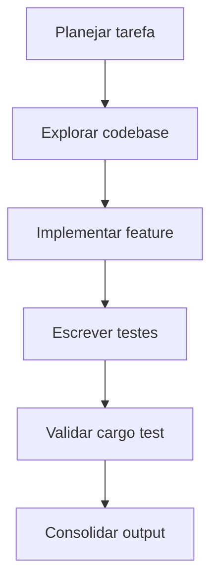
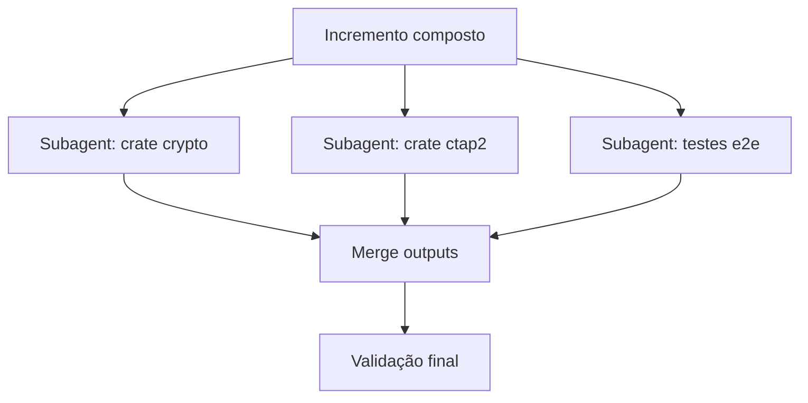
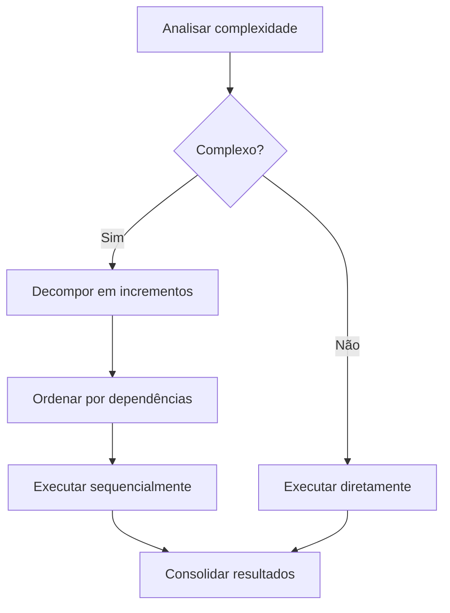
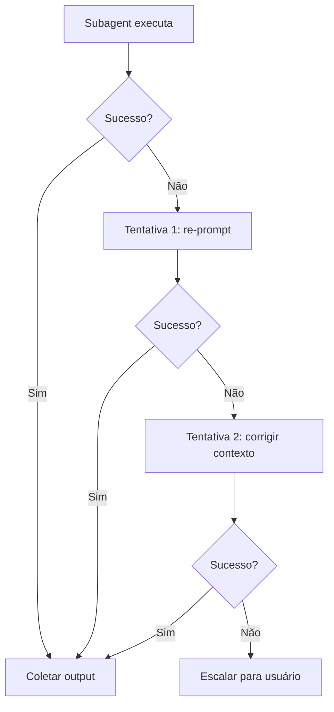
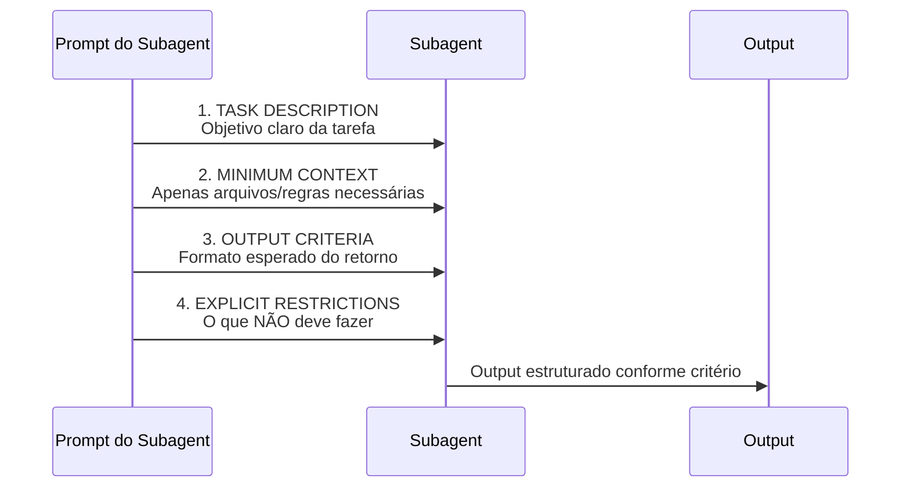
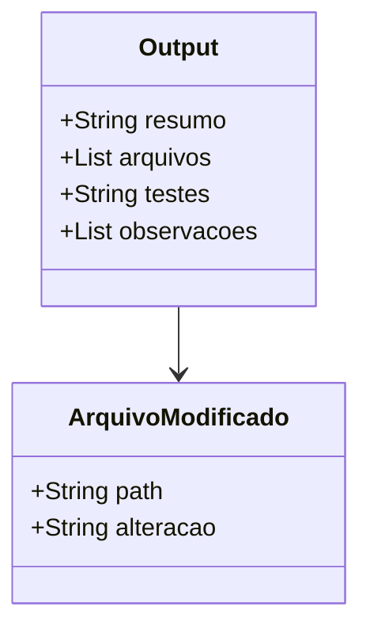
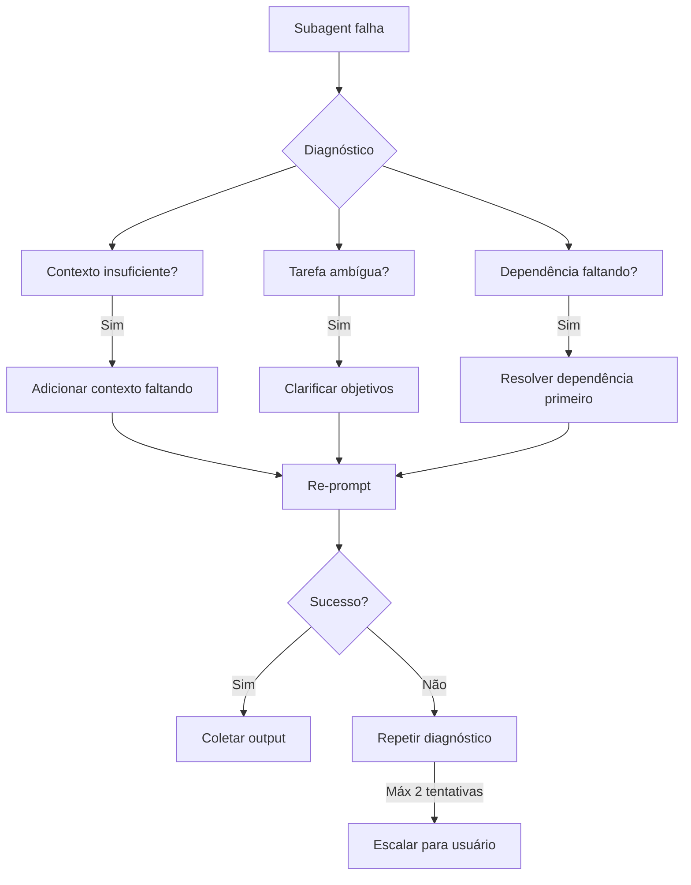

# Documentação Técnica: Execução de Subagents

> Arquitetura operacional para orquestração de subagents de IA no projeto openkey-fido2.

---

## Sumário

1. [Visão Geral](#1-visão-geral)
2. [Tipos de Agentes](#2-tipos-de-agentes)
3. [Estratégia de Carregamento de Contexto](#3-estratégia-de-carregamento-de-contexto)
4. [Padrões de Orquestração](#4-padrões-de-orquestração)
5. [Fluxo de Prompt e Output](#5-fluxo-de-prompt-e-output)
6. [Tratamento de Falhas](#6-tratamento-de-falhas)
7. [Referências Externas](#7-referências-externas)

---

## 1. Visão Geral

O projeto openkey-fido2 utiliza **subagents** (agentes secundários) para granularizar
tarefas complexas do desenvolvimento. O agente principal orquestra esses subagents,
distribuindo contexto mínimo e coletando outputs estruturados.

```
┌───────────────────┐     ┌──────────────────┐     ┌──────────────────┐
│  Agente Principal │     │  Subagent A      │     │  Subagent B      │
│                   │     │  (explore)       │     │  (general)       │
│  • Planeja        │────▶│  • Busca código  │     │  • Implementa    │
│  • Orquestra      │────▶│  • Localiza deps │────▶│  • Testa         │
│  • Consolida      │     │  • Retorna paths │     │  • Retorna código│
└───────────────────┘     └──────────────────┘     └──────────────────┘
```

---

## 2. Tipos de Agentes

### 2.1 `explore` — Exploração de Codebase

**Finalidade:** Busca e mapeamento de código sem modificações.

| Característica       | Detalhe                                         |
|----------------------|-------------------------------------------------|
| **Uso**              | Localizar definições, mapear dependências       |
| **Contexto recebido**| Issue + especificação/ADR/paths relevantes      |
| **Ferramentas**      | Glob, Grep, Read, Task                          |
| **Output esperado**  | `path/arquivo.rs:linha` + resumo                |
| **Restrições**       | Não modificar código, não commitar              |

### 2.2 `general` — Execução Multietapa

**Finalidade:** Implementação, refactoring, testes.

| Característica       | Detalhe                                         |
|----------------------|-------------------------------------------------|
| **Uso**              | Implementar incrementos, escrever código        |
| **Contexto recebido**| Issue + TODO.md (seção) + spec/ADR/paths        |
| **Ferramentas**      | Write, Edit, Bash, Read                         |
| **Output esperado**  | Código + testes passando + resumo               |
| **Restrições**       | Seguir ADRs, não commitar sem permissão         |

### 2.3 `defect-cycle` — Ciclo de Defeito (ADR-0019)

**Finalidade:** Levar um bug, regressão ou falha de conformidade da detecção à
reprodução, correção mínima e validação ponta a ponta.

| Característica       | Detalhe                                         |
|----------------------|-------------------------------------------------|
| **Uso**              | Falha confirmada que exige código + regressão   |
| **Contexto recebido**| Issue + spec/ADR/paths/testes relevantes        |
| **Output esperado**  | Status + evidência das quatro fases             |
| **Restrições**       | Não commitar, fazer push, resetar ou descartar  |

O agente deve retornar `fixed`, `not_reproduced`, `blocked`, `no_fix_needed` ou
`partially_fixed`. O status `fixed` exige um reproducer que falhava antes e a
mesma validação passando depois da correção. A configuração completa está em
`.opencode/agents/defect-cycle.md`.
A decisão arquitetural está registrada em
`docs/adr/ADR-0019-subagent-ciclo-defeitos-ponta-a-ponta.md`.

---

## 3. Estratégia de Carregamento de Contexto

O agente principal segue a rota canônica definida em [`AGENTS.md`](../AGENTS.md)
e no [`ADR-0018`](../docs/adr/ADR-0018-roteamento-progressivo-contexto.md):

```text
Issue → AGENTS.md → especificação relevante → ADR relevante →
arquivos fonte relevantes → skill relevante
```

O item relacionado do `TODO.md` é consultado durante a identificação do Issue,
sem carregar o arquivo inteiro. Cada etapa carrega somente seções e paths
necessários. A busca pode localizar arquivos fonte antes da leitura, mas os
requisitos da especificação e as decisões dos ADRs orientam a interpretação do
código.

---

## 4. Padrões de Orquestração

### 4.1 Pipeline Sequencial

Para tarefas onde cada etapa depende da anterior.



### 4.2 Fan-out Paralelo

Para tarefas independentes em crates diferentes.



### 4.3 Plan-then-Execute

Para tarefas complexas com múltiplas dependências.



### 4.4 Circuit Breaker de Falhas



---

## 5. Fluxo de Prompt e Output

### 5.1 Estrutura do Prompt

Todo prompt para subagent deve conter:



### 5.2 Exemplo de Prompt Bem Estruturado

```
TASK: Implementar `getPINRetries` no módulo client_pin

CONTEXT:
- AGENTS.md:193-199 — Como criar um ADR
- TODO.md:92 — Critério: teste unitário `test_get_pin_retries` passando
- protocol/ctap2/src/client_pin.rs — trait ClientPin já definida
- firmware/storage/src/storage.rs:12-20 — StorageEngine interface

OUTPUT:
Formato: ```
Resumo: [o que foi feito]
Arquivos modificados:
- path/arquivo.rs — [mudança]
Testes: cargo test -p ctap2 get_pin_retries [PASS]
```

RESTRICTIONS:
- Não modificar trait ClientPIN (apenas implementar)
- Não commitar mudanças
- Não alterar arquivos fora de protocol/ctap2/src/client_pin.rs
```

### 5.3 Contrato de Output



---

## 6. Tratamento de Falhas

### 6.1 Diagnóstico de Falha



### 6.2 Escalação para Usuário

Quando falhar após 2 re-prompts:

1. **Compilar diagnóstico:** o que foi tentado, por que falhou, outputs de cada tentativa
2. **Apresentar opções:** dividir tarefa, remover dependência, ou escalonar
3. **Documentar:** atualizar ADR se a falha indica gap na arquitetura

---

## 7. Referências Externas

- **ADR-0005:** `docs/adr/ADR-0005-isolamento-contexto-agentes.md`
- **ADR-0018:** `docs/adr/ADR-0018-roteamento-progressivo-contexto.md`
- **AGENTS.md:** Guide de workflow do agente
- **TODO.md:** Fonte de incrementos com dependências
- **Skills:** `.opencode/skills/` — contexto operacional específico por tarefa
- **Criar novo ADR:** `AGENTS.md:193-199`

```
┌─────────────────┐         ┌──────────────────┐
│  Esta documentação  │◄──────▶│     ADR-0007     │
│  (doc/subagents.md) │         │  (arquitetura)   │
└─────────────────┘         └──────────────────┘
        ▲                              ▲
        │                              │
        ▼                              ▼
┌─────────────────┐         ┌──────────────────┐
│    AGENTS.md    │         │      TODO.md     │
│ (roteador)      │         │ (tarefas)        │
└─────────────────┘         └──────────────────┘
```

---

*Documento criado em 2026-08-09 baseado no ADR-0007, atualizado para a rota do
ADR-0018 e os padrões estabelecidos em AGENTS.md.*
